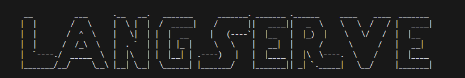

# 🤖LLm Model API
This project make the use of **FastAPI** and **OpenAI Model** to create a API intergration with llm models.
Made the use of langchain to connect the openai model to fastapi.
This app includes **UI Interaction**  using **Streamlit**

# 🧠Project Overview 
- Here Openai model is used to get the answer for the inputted text.
- It generates the ouput based on the input given like to generated (eassy and poems)
- It is integrated with fast api
- Made the use of langserve to generated endpoints , it generates multiple endpoints by itself.




## 🚀 Getting Started
### ⚙️Prerequisites
Make sure you have Python installed (>=3.9 recommended).
You’ll also need to install dependencies listed in `requirements.txt`.

###  1. 🌐Create a virtual environment
``` bash
python -m venv venv
```
Activate :
``` bash
Venv\Scripts\activate
```

### 2. 🔃Install dependencies 
``` bash
pip install -r requirements.txt
```  
### 3. 🏃To run 
``` bash
if __name__ == "__main__":
    uvicorn.run("server:app", host='localhost' , port = 8000 , reload = True)
```
- You can use any port number as per your requirements
- And here 'localhost' is used there is an alternative host **127.0.0.1** which can be used to run the fastpi application.
</br>

# ⚙️Server.py 
- Adding routes with the use of langserve
  ``` bash
  add_routes(
    app,
    ChatOpenAI(),
    path  = "/openai")
  ```
# 👩‍💻Client.py 
- used the **requests** function to get the data from the **server side**
``` bash
def get_eassy(text_input):
    response = requests.post("http://localhost:8000/eassy/invoke",
                             json = {'input':{'topic':text_input}})
```
- **POST** Method is used to give the input at the **URl:** ***"http://localhost:8000/eassy/invoke"***  sepcified.
- Made the use of **json** to get the data.

<br>
### 🙌Acknowledgement
Built with FastAPI — a modern, fast (high-performance) web framework for API development in Python.


<b><p>⭐ If you found this repository useful, consider giving it a star!</p>
  <p>Happy Coding 🐍✨</p></b>
<br>
👤 Github  : [@droliasakshi12](https://github.com/droliasakshi12)<br>
📩 Email   : sakshidrolia12@gmail.com <br>
🔗 Linkdin : https://www.linkedin.com/in/sakshi-drolia12<br>
</br>

<b><h5>Author</h5></b>
<h6><b>Sakshi Drolia</b></h6>

